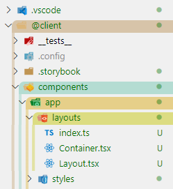

# VSCode Explorer Colorizer

VSCode のエクスプローラをディレクトリの階層ごとに色分けするカスタム CSS



## 📌 Update (2020/7/17)

`mixins.js` の形式が変わったので **Download & Build の 3 以降を再度実行**してください

## Requirements

-   Node.js (>= 12)

## Download & Build

1.  `git clone https://github.com/yarnaimo/vscode-explorer-colorizer.git`
2.  `cd vscode-explorer-colorizer`
3.  `cp mixins.example.js mixins.js`
4.  必要に応じて `mixins.js` をカスタマイズ
5.  `yarn build` または `npm run build`

## Install

1.  拡張機能「Custom CSS and JS Loader」をインストールする
2.  settings.json に以下を追加
    ```
    "workbench.tree.indent": 10,
    "vscode_custom_css.policy": true,
    "vscode_custom_css.imports": [
        "<cssのパス>"
    ]
    ```
    css のパスの例
    -   **Windows** `file:///C:/Users/me/dev/vscode-explorer-colorizer/main.css`
    -   **Linux/macOS** `file:///Users/me/dev/vscode-explorer-colorizer/main.css`
3.  VSCode を管理者権限で再起動する (Linux/macOS の場合は[こちら](https://marketplace.visualstudio.com/items?itemName=be5invis.vscode-custom-css#mac-and-linux-users))
4.  コマンドパレット (Ctrl+Shift+P) で **Reload Custom CSS and JS** を実行する
5.  VSCode を再起動する (管理者権限は不要)

settings.json の `workbench.tree.indent` と、mixins.js の `indentSize` を変更すると、インデントサイズを 10px 以外にできます。(この 2 つは同じ値にしてください)
